# G Sumanth-General Task Report

## Task 1: 3D Printing

Really blown away by using the 3D printer. I learnt how it works and how to set it up for printing and the importance of bed and nozzle temperature . I printed a flexible 3D model of a Pokemon - Rayquaza.

  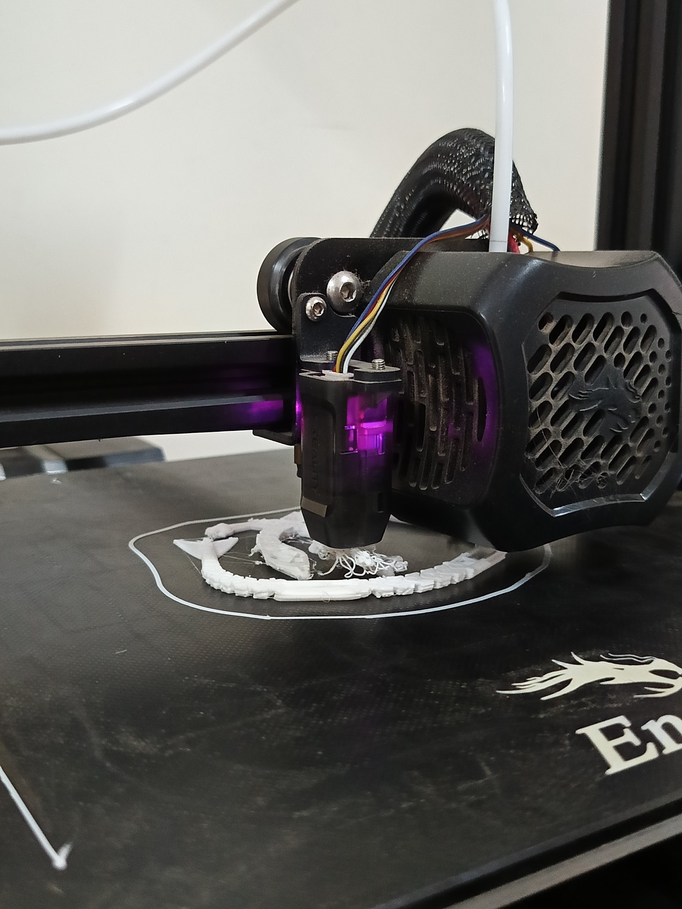
  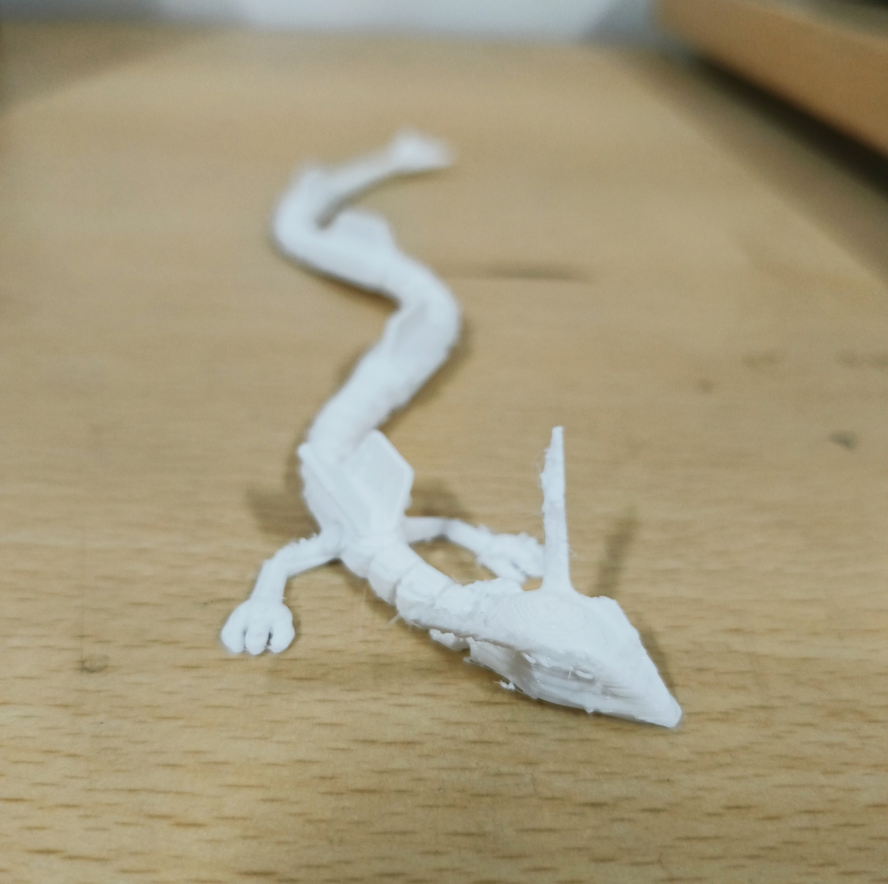

   

## Task 2:API

Using Google's Gemini API , I built a simple chatbot website, using python’s streamlit. It lets the user enter a question, and the website communicates with Gemini and gives the response to the question. I also made it so that all the chat history is saved for a running session. This task was really insightful, I learned about APIs and how we can use API keys.

[Github link](https://github.com/Siuumanth/Gemini-chatbot)

 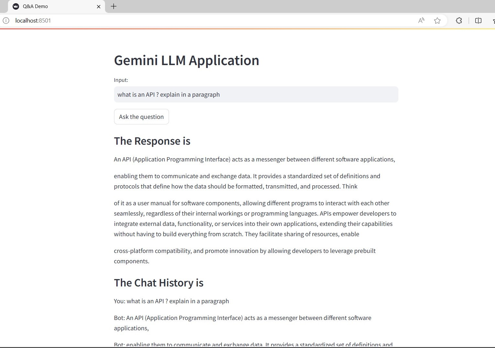
 

   

## TASK 3: Working with Github

Familiarised myself with GitHub related actions like pull request, forking,cloning,committing.

I forked the git-task repository, cloned it and created a branch . I fixed the error in the folder and committed it to my forked repo. I then pushed the changes into my forked repository and then issued a pull request to merge my changes with the main branch.

 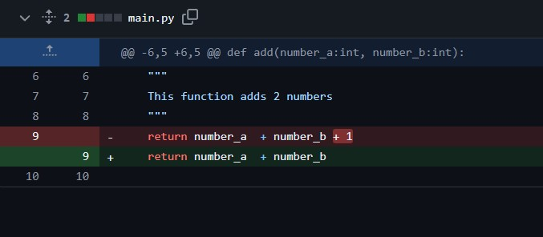
  
 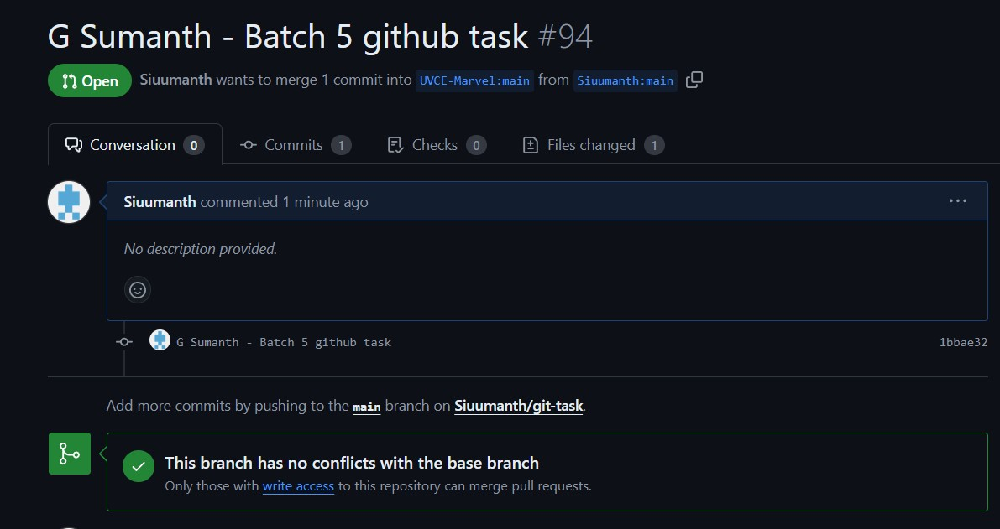
 

   

## TASK 4: Getting familiar with the command line on ubuntu:

I learned to use the command line on Ubuntu for basic tasks like navigating through folders , creating folders,directories,etc..I created 2 text files , added text into it and concatenated them. I also created 2600 folders with the specified naming convention.

 
   
 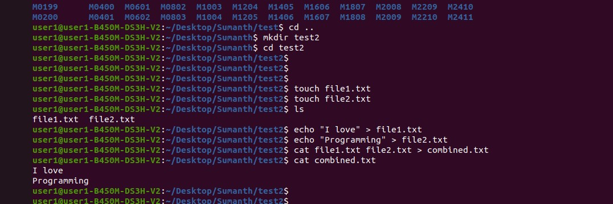
 

   

## TASK 5: Kaggle Contest

Learned to build a machine learning model using the titanic survival dataset from Kaggle. Learnt about the different processes it takes to build a model, like data cleaning,encoding,training,parameter tuning, testing,validation,etc. Tested 2 algorithms, SVM with different parameters ,and decision tree, and found out decision tree works best.Here is the confusion matrix:

 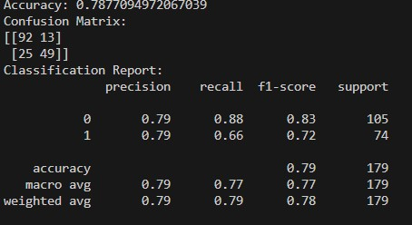
   

Also wrote a flask server around the model, and made an HTML form that accepts input features for the model like gender,class,parch,etc. And returns output whether the passenger survives or not.

 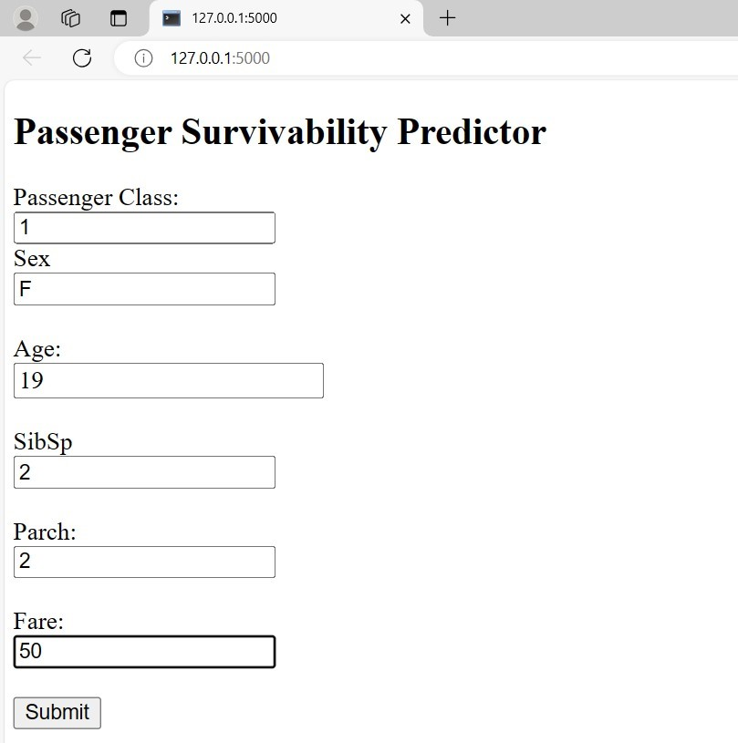
 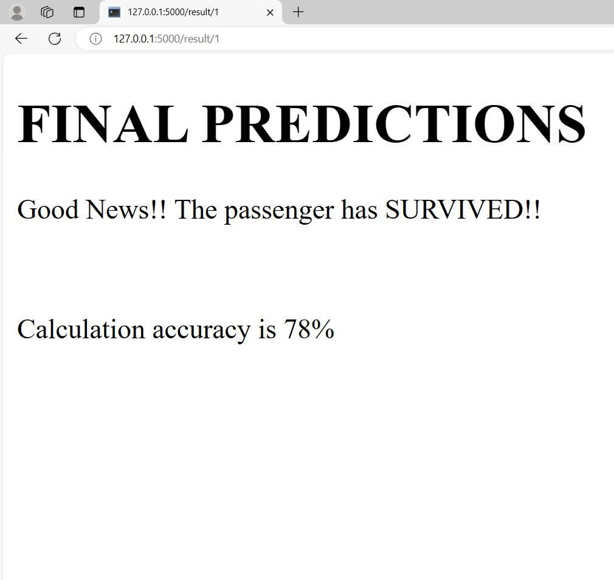

   

## TASK 6: Working with Pandas and Matplotlib
Learned to work with the Pandas and Matplotlib library. I used the titanic dataset from Kaggle to generate bar graph and line chart based on the data. I learnt how we can use graphs and line charts for data visualisation , to understand better about the data we deal with.

 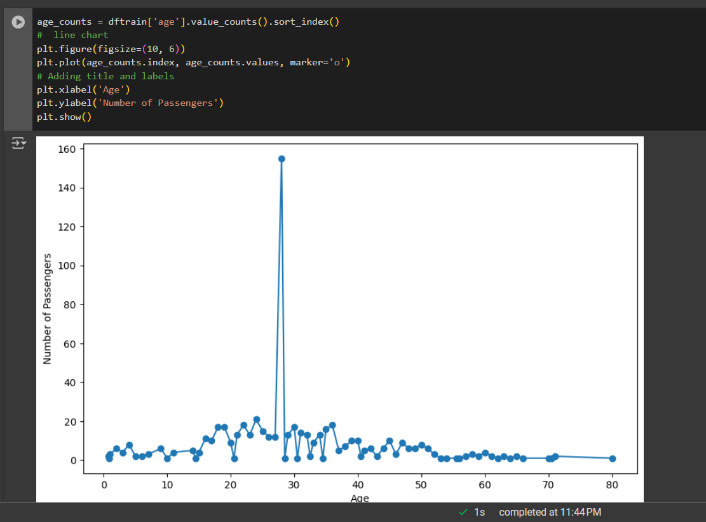
 

   

## TASK 7: Creating a Portfolio Webpage
Made a simple portfolio webpage , using the Flutter framework. I wanted to try something new with Flutter. I included relevant details like my skills,interests,about and projects. Also included the necessary links for my contacts and projects.

[Github link](https://github.com/Siuumanth/Flutter---portfolio)

 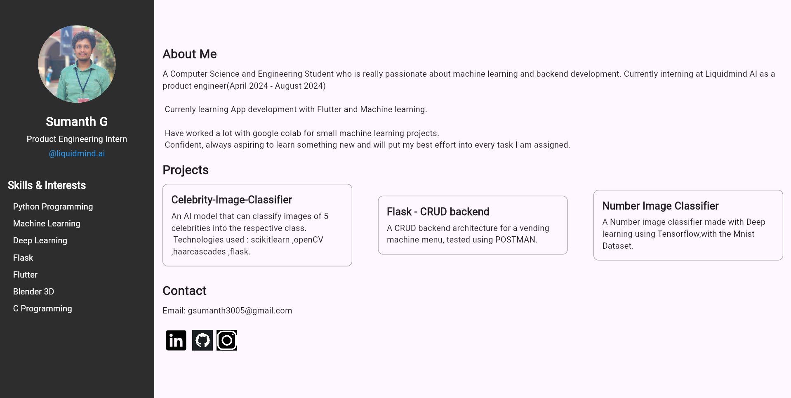

   

## TASK 8: Writing Resource Article using Markdown

Wrote a research article on “Securing APIs”. It highlights the different type of attacks that can happen on your APIs and how you can secure them , taking necessary precautions. Some methods include using Oauth, using API gateways and using Json web tokens for Authorization . Here is the [link](https://hub.uvcemarvel.in/article/89e8678e-8c43-496a-b9e2-67947eaf55aa)

 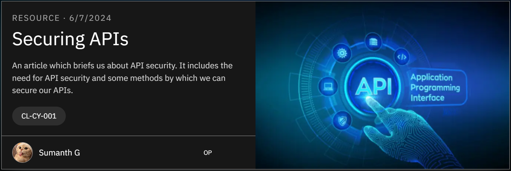
 

 
 

## TASK 9: Tinkercad

Familiarised myself with tinkercad, by building simple circuits with it using transistors . I learnt to build an ultrasonic radar system with Arduino UNO , and learned to code it. It was very insightful.

[Link to the tinkercad file.](https://www.tinkercad.com/things/cNZ90iPHtjN-radar/editel?returnTo=%2Fthings%2FcNZ90iPHtjN-frantic-snicket-habbi) 

 
 

   

## TASK 10: Speed Control of DC Motor
Learnt the functions of the different hardware conponents involved, like the Arduino UNO, H-Bridge L293D motor driver,servo motor , oscilloscope ,etc.
Got code from the internet for the Arduino UNO, and I faced a lot of issues working with the code and the circuit. Built a circuit using all the components, learnt to use the oscilloscope for current and voltage control and was able to control the motor speed by using the potentioimeter. 

<video width="640" height="480" controls>
  <source src="assets/dc_motor_vid.mp4" type="video/mp4">
  Your browser does not support the video tag.
</video>
 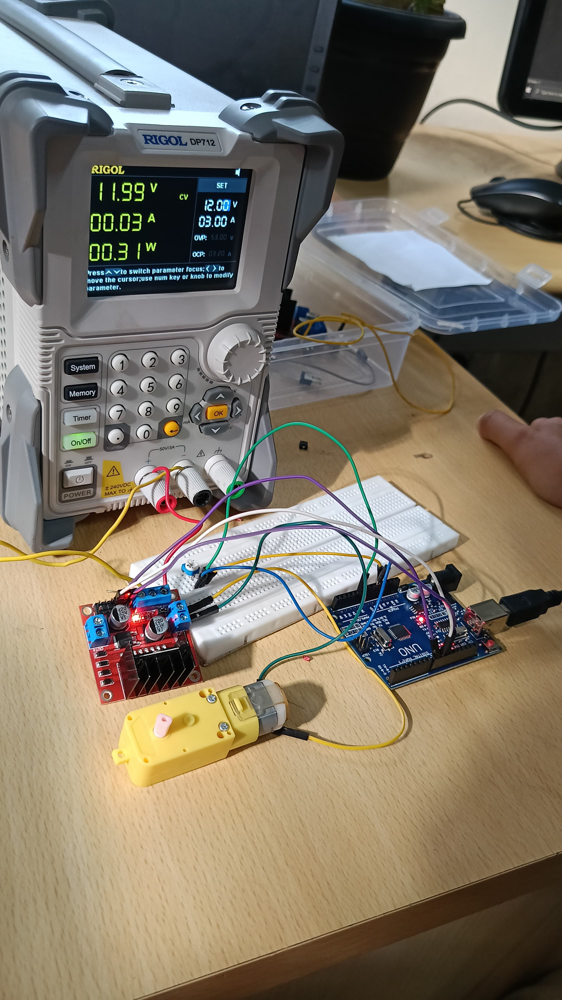

   

## TASK 11: LED Toggle Using ESP32
Learnt briefly about the working of an ESP32 microcontroller. Built a circuit with breadboard,jumper wires, ESP32 , resistors, LEDs . I set up ESP32 with ArduinoIDE with the code from the web, briefly understood the code and built a web server surrounding the same . After a lot of error handling, I was able to access the web server from my phone.
 
The webserver enbabled me to toggle LEDs on the breadboard on and off, felt really satisfied by the result.

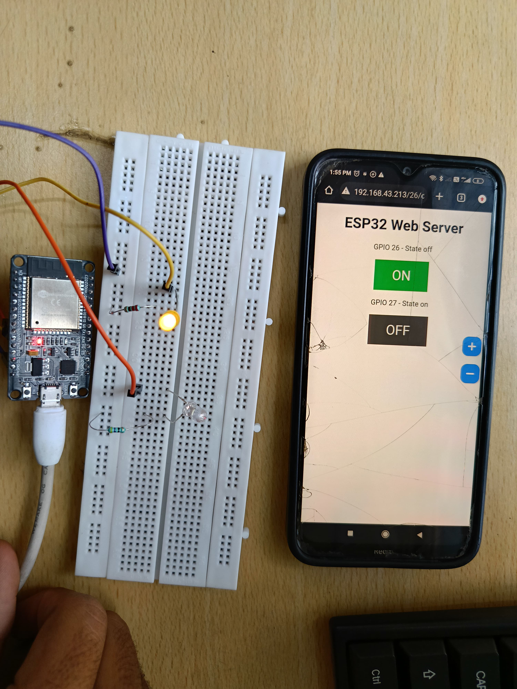

   

## Task 12 : Soldering Prerequisites

Learned the basics of soldering, and how to use the soldering iron ,along with the soldering wick, flux. Used the perforated bread board to create a basic LED circuit .

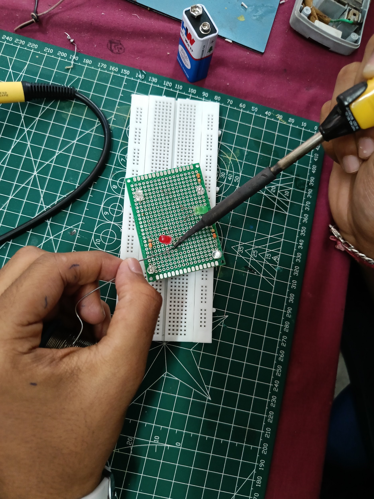
 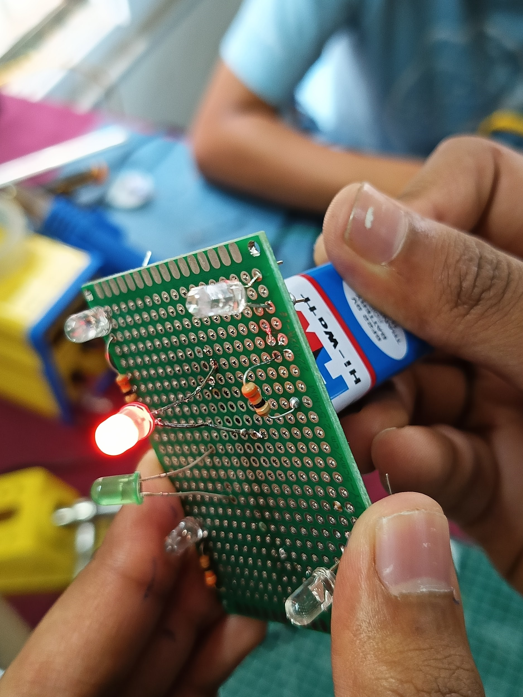

  

## Task 13: Active Participation

I participated in the “National Coding League - 2024” , conducted by Scaler School of Technology . It was a team competition where we were required to solve DSA questions . We tried our best .. but it was pretty new for us , and we couldn't perform very well. We got an idea of what to expect in the future and it was really educational !

I also completed a small course on “System Design of Instagram ” on Scaler. I was really blown away by learning what really goes into designing a large scale system , like instagram , and I even made an [article](https://docs.google.com/document/d/1l77ivnyo3nI6P9JNihQrQn8sn20_8C8Frw1UPbULehM/) on it.

 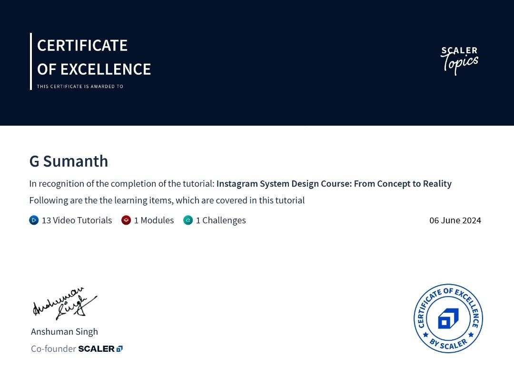

